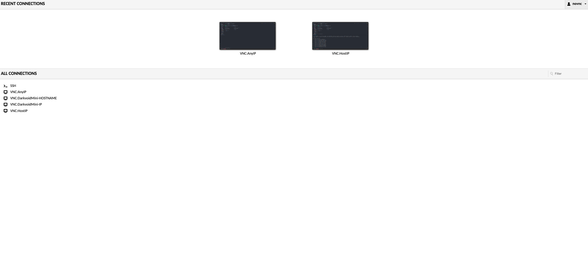
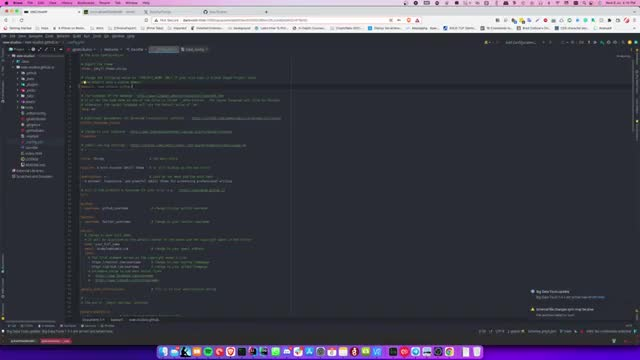
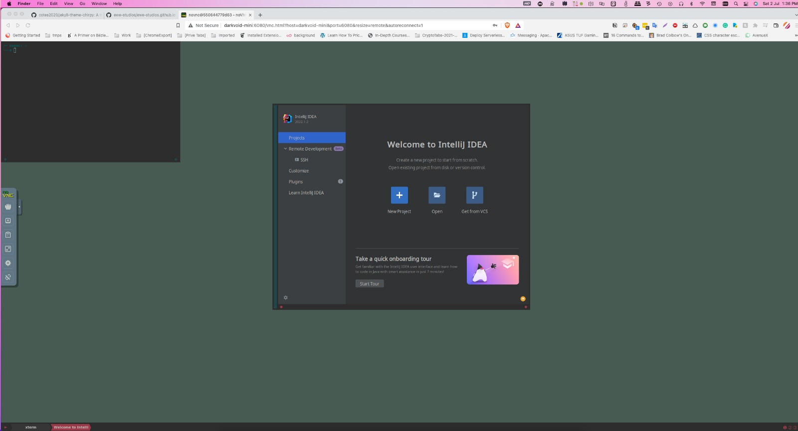

# IntelliJ Ultimate
Docker image for my favorite code editor: intellij Ultimate.

### Base Image

- [Alpine:Edge](https://hub.docker.com/_/alpine)
- [influx6:novnc](https://hub.docker.com/r/influx6/novnc)

## Docker

- [IntelliJ Ultimate](https://hub.docker.com/r/influx6/intellij-u)
- [IntelliJ Community](https://hub.docker.com/r/influx6/intellij-c)

**Example**
```
docker run -d \
    -p 5900:5900 \
    -p 6080:6080 \
    -p 7080:7080 \
    --name=novnc \
    -e DISPLAY_WIDTH=<> \
    -e DISPLAY_HEIGHT=<> \
    -e DISPLAY_DEPTH=<> \
    -e VNC_SERVER=<x11 or tigervnc> (default: tigervnc) \
    -e VNC_PASSWORD=mypassword \
    -e GUACA_PASSWORD=mypassword \
    influx6/intellj-u:latest
```

## Docker Compose

File:  docker-compose.yml

```yaml
version: "3.5"

networks:
  default:
    external:
      name: app-networks

volumes:
  intelliju-volume-data:

services:
  code-server-intellij:
    image: "influx6/intellij-u:0.0.4"
    restart: unless-stopped
    container_name: code-server-intellij
    security_opt:
      - apparmor=unconfined
      - seccomp=unconfined
    environment:
      - PUID=1000
      - PGID=1000
      - "APP=INTELLIJ_UL"
      - "VNC_PASSWORD=$VNC_PASSWORD"
      - "GUACA_PASSWORD=$GUACA_PASSWORD"
      - "SECURITY_TYPE=$SECURITY_TYPE"
      - "GUACA_SSL=$GUACA_SSL"
    volumes:
      - intelliju-volume-data:/home/novnc/.idea
      - "$SERVER_HOME/Lab:/home/novnc/Lab:rw"
      - "$HOST_FILE:/etc/hosts:rw"
      - "$TERMINAL_FILE:/etc/.terminal:ro"
      - "$SSH_FILE:/etc/ssh/id_rsa:ro"
      - "$SSH_PUB_FILE:/etc/ssh/id_rsa.pub:ro"
      - "$SSH_FILE:/home/novnc/.ssh/id_rsa:ro"
      - "$SSH_PUB_FILE:/home/novnc/.ssh/id_rsa.pub:ro"
    ports:
      - "6080:6080"
      - "7080:8080"
      - "5900:5900"

```

Be aware as exactly as above, feel free to customize.

Which can be executed as:

```bash
docker-compose --env-file .env -f docker-compose.yml
```

Important points:

```yaml
security_opt:
  - apparmor=unconfined
  - seccomp=unconfined
```

These security grants are required as there are errors with the container running file system related operations, so be it via docker-compose or plain docker run commands ensure to include them.

```bash
docker run --security-opt apparmor=unconfined --security-opt seccomp=unconfined ...
```


## Example

Check the [examples](./examples) directory for a docker-compose for this project.

Note not all environment variables are provided and in general you don't need them as they are specific to my needs.
Feel free to modify these to suit your needs.

The focus is how I boot and run the image.

## Guacamole Client

Installed with the VNC client is a guacamole client and server which can act as a better alternative to raw NoVNC web app for
accessing your service.

Simply navigate to: http://localhost:7080/guacamole

Default username and password are: novnc (password can be customized via environment variables `GUACA_PASSWORD`)

Guacamole Login



IntelliJ via Guacamole




[](https://youtu.be/zIjhRxnz51w)


## NoVNC Web App



**Access via web interface (noVNC)**

`https://<host ip>:<host port>/vnc.html?resize=remote&host=<host ip>&port=<host port>&&autoconnect=1`

e.g.:-

`https://192.168.1.10:6080/vnc.html?resize=remote&host=192.168.1.10&port=6080&&autoconnect=1`

Project comes with a self-signed certificate, so you will have to tell your browser to load page regardless of warning. 

**Access via VNC client**

`<host ip>::<host port>`

e.g.:-

`192.168.1.10::5900`

**Usage**
```
docker run -d \
    -p 5900:5900 \
    -p 6080:6080 \
    --name=<container name> \
    influx6/intellij-u:latest
```

To run with another application, write your own docker file:

```docker-file
FROM influx6/intellij-u:latest
RUN \
    # Install xterm
    apk add xterm && \
    # Append xterm entry to supervisord.conf
    cd /etc/supervisord/ && \
    echo '[program:xterm]' > 03-myapp.conf && \
    echo 'command=xterm' >> 03-myapp.conf && \
    echo 'autorestart=true' >> 03-myapp.conf
```


**Notes**

User ID (PUID) and Group ID (PGID) can be found by issuing the following command for the user you want to run the container as:-

```
id <username>
```

### Gotcha

I noticed at times even when directly using Guacamole or other VNC client that the size of the display is usually small,
I have yet to find a way to fix this, but the NoVNC client seems to have some underline logic that will force a resize of
giving display, so if you see your desktop VNC client or Guacamole displaying a smaller size than your available desktop space, do the following:

1. Navigate to the NoVNC web login portal (see [NoVNC Web App](#novnc-web-app) section)
2. Login with your login credentials
3. NoVNC will show your desktop
4. Ensure resize=remote is enabled in settings
5. Apply settings if not.

You can also paste the following url with the correct options

`https://[ip]:6080/vnc.html?resize=remote&host=192.168.1.10&port=6080&&autoconnect=1`

These will correct the display size and will reflect on other VNC client you are using.
